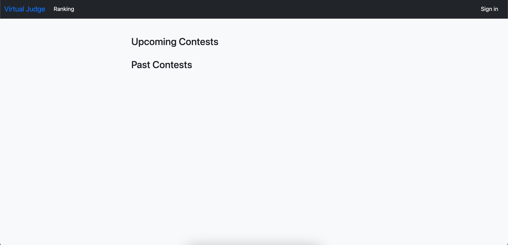

Guia de Instalação
==================

.. rst-class:: lead

   Aqui você encontrará instruções e informações necessárias para a instalação
   e execução do projeto.

Ambiente
--------

Recomendamos o uso de **distribuições baseadas em Debian** como ambiente de
desenvolvimento do projeto. Se você estiver usando Windows, recomendamos o uso
do `WSL <https://docs.microsoft.com/en-us/windows/wsl/install-win10>`_ para
virtualizar um ambiente Linux, e caso você esteja usando alguma outra
distribuição Linux ou macOS, adapte os comandos de acordo.

Para rodar o projeto, você precisará instalar Python 3.11.5 e o gerenciador de
pacotes `Poetry <https://python-poetry.org/>`_. Se atente em instalar as
versões corretas do Python e do Poetry, pois não há garantias de que funcionará
em versões diferentes.

Docker e Docker Compose
~~~~~~~~~~~~~~~~~~~~~~~

Usamos `Docker <https://docs.docker.com/engine/install/ubuntu/>`_ e
`Docker Compose <https://docs.docker.com/compose/install/linux/>`_ para
facilitar a instalação e execução do projeto. Nós **recomendamos fortemente**
que você use Docker e o Docker Compose para rodar o projeto, já que eles
criam e configuram automaticamente o ambiente de desenvolvimento, incluindo o
banco de dados e o servidor do Django.

.. note::

   Apesar de não ser obrigatório instalar o Python e o Poetry (já que o projeto
   usa Docker), recomendamos que você instale-os de qualquer maneira, pois isso
   facilitará a instalação de outras ferramentas de desenvolvimento que serão
   mencionados no decorrer do guia.

O guia de instalação assume que você já tenha instalado o Docker e o Docker
Compose.

Instalação
----------

Assumindo que você tenha instalado o Python, o Poetry e o Docker, você pode
instalar o projeto com os seguintes comandos:

.. code-block:: bash

   # Clonando o repositório do projeto:
   $ git clone https://github.com/unb-mds/2023-2-Squad06.git
   # Entrando na pasta do projeto:
   $ cd 2023-2-Squad06

Tendo feito isso, instale as dependências do projeto com o Poetry:

.. code-block:: bash

   $ poetry install
   # Caso você precise das dependências de documentação, use:
   $ poetry install --with docs

.. warning::

   Caso você esteja enfrentando alguns dos seguintes erros:

   .. code-block:: bash

      Error: pg_config executable not found.
      # Ou o seguinte erro:
      Python.h: No such file or directory.

   Isso significa que você precisa instalar algumas dependências do sistema
   que são necessárias para instalar o projeto. Para instalar essas
   dependências, use o seguinte comando:

   .. code-block:: bash

      $ sudo apt install libpq-dev python3-dev

Crie o arquivo de ambiente usando o script do próprio projeto:

.. code-block:: bash

   $ poetry run ./bin/create-env

.. warning::

   O comando acima não funciona em ambientes Windows. Se você estiver usando
   Windows, crie o arquivo de ambiente manualmente usando o arquivo
   ``config/.env.example`` como base.

   Você consegue gerar uma chave secreta para o Django usando o seguinte comando:

   .. code-block:: bash

      $ poetry run python -c "from django.utils.crypto import get_random_string; print(get_random_string(64))"

Por fim, rode o projeto com o Docker:

.. code-block:: bash

   $ docker compose up

.. warning::

   Caso você esteja enfrentando o seguinte erro:

   .. code-block:: bash

      docker env: bash\r: No such file or directory

   Este problema está relacionado em como o Windows lida com
   `quebras de linha <https://en.wikipedia.org/wiki/Newline>`_. Para resolver
   esse problema, você pode usar o seguinte comando:

   .. code-block:: bash

      $ git config --global core.autocrlf false

   Também pode ser necessário alterar as configurações do seu editor de texto
   para que ele use quebras de linha do tipo ``LF`` ao invés de ``CRLF``. Para
   mais informações, olhe este `link <https://stackoverflow.com/q/5834014>`_.

O site estará disponível em ``http://localhost:8000``, no entanto, é necessário
rodar as migrações do banco de dados para que o site funcione corretamente.
Feche o servidor do Django pressionando :kbd:`Ctrl+C` e reabra o servidor
no modo de execução em segundo plano com o seguinte comando:

.. code-block:: bash

   $ docker compose up -d

Desta vez, o servidor do Django estará rodando em segundo plano. Para rodar as
migrações do banco de dados, você precisará criar um container temporário que
executará as migrações. Faça isso com o seguinte comando:

.. code-block:: bash

   $ docker compose run --rm django python manage.py migrate

.. hint::

   O comando ``docker compose run`` cria um container temporário que executa o
   comando especificado, o parâmetro ``--rm`` faz com que o container seja
   removido automaticamente após a execução do comando, o parâmetro ``web``
   especifica que o container será criado a partir do serviço ``web`` do
   arquivo ``docker-compose.yml`` e o parâmetro ``python manage.py migrate``
   especifica o comando que será executado no container.

.. note::

   Você precisará executar esse comando toda vez que o projeto for atualizado
   e houver novas migrações do banco de dados.

Se tudo ocorreu bem, o site estará disponível em ``http://localhost:8000``. E
você será recebido com uma tela parecida com esta:

Para fechar o servidor do Django, use o seguinte comando:

.. code-block:: bash

   $ docker compose down
   # Caso você queira remover os volumes do Docker, use:
   $ docker compose down -v
   # Isto removerá os volumes do Docker, o que significa que os dados do banco
   # de dados serão perdidos.

Para executar os testes do projeto, use o seguinte comando:

.. code-block:: bash

   $ docker compose run --rm django python manage.py test

Se você precisar olhar os logs do servidor do Django, use o seguinte comando:

.. code-block:: bash

   $ docker compose logs

Desenvolvimento Local
---------------------

Git Hooks
~~~~~~~~~

Para desenvolver o projeto, recomendamos usar as ferramentas de desenvolvimento
do projeto. A primeira ferramenta são os Git hooks, que são scripts que são
executados automaticamente quando você executa certos comandos do Git. Para
instalar os Git hooks, use o seguinte comando:

.. code-block:: bash

   $ poetry run pre-commit install \
     --hook-type pre-commit \
     --hook-type pre-push \
     --hook-type commit-msg

É importante instalar os Git hooks para que seu código seja formatado
da maneira correta e para que os testes sejam executados antes de cada
commit. Caso você não queira instalar os Git hooks, você pode pular essa
etapa, mas é importante que você execute os testes e formate seu código
manualmente antes de cada commit, caso contrário seu commit será rejeitado
pelo CI (GitHub Actions).

Django
~~~~~~

Quando você rodar o projeto, você talvez precisará criar um superusuário para
acessar o painel de administração do Django. Para criar um superusuário, use o
seguinte comando:

.. code-block:: bash

   $ docker compose run --rm django python manage.py createsuperuser

E para criar migrações do banco de dados, use o seguinte comando:

.. code-block:: bash

   $ docker compose run --rm django python manage.py makemigrations
